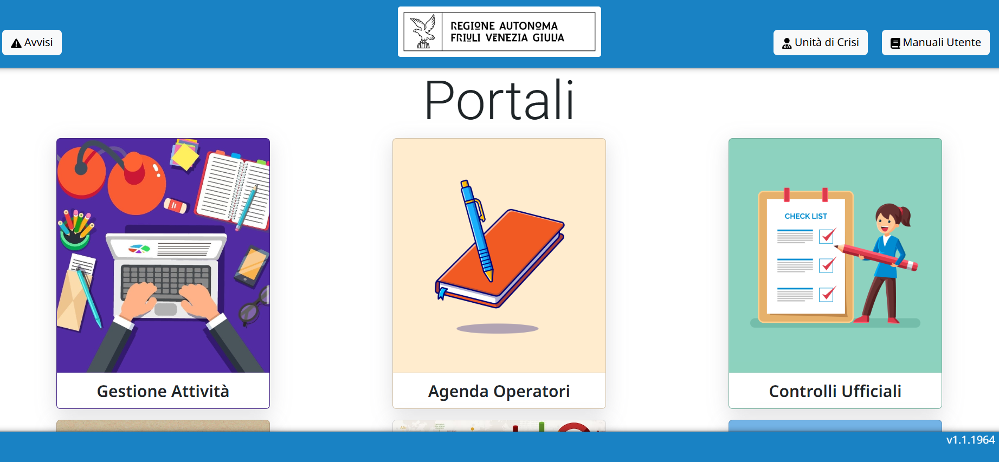
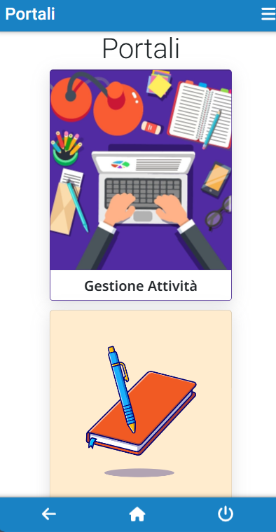

# GISA Friuli Venezia Giulia
- [1. Descrizione e finalità del software](#1-descrizione-e-finalità-del-software)
  - [1.1 Descrizione della struttura repository](#11-descrizione-della-struttura-repository)
  - [1.2 Interoperabilità con i sistemi esterni](#12-interoperabilità-con-i-sistemi-esterni)
  - [1.3 Link a pagine istituzionali relative al progetto](#13-link-a-pagine-istituzionali-relative-al-progetto)
  - [1.4 Interfaccia web](#14-interfaccia-web)
- [2. Riuso ed installazione](#2-riuso-ed-installazione)
  - [2.1 Creazione e import database](#21-creazione-e-import-database)
  - [2.2 Modello file di configurazione “environment.ts” e “config.js”](#22-modello-di-configurazione-envirormens.ts-e-config.js)
  - [2.3 Installazione in un ambiente di sviluppo](#23-installazione-in-un-ambiente-di-sviluppo)
  - [2.4 Installazione in un ambiente di produzione](#24-installazione-in-un-ambiente-di-produzione)
- [3. Licenza](#3-licenza)
  - [3.1 GisaFVG](#31-GisaFvg)
  - [3.2 Indirizzo e-mail segnalazioni di sicurezza](#32-indirizzo-e-mail-segnalazioni-di-sicurezza)
  - [3.3 Titolarità](#33-titolarità)

# **1. Descrizione e finalità del software**
L’applicativo G.I.S.A. FVG è una piattaforma web per la gestione delle attività dei Dipartimenti di Prevenzione, in particolare per la Sicurezza Alimentare e la Profilassi di competenza veterinaria. 
La soluzione supporta l’ASL, i dipartimenti e i distretti in tutte le fasi che riguardano la definizione e la gestione delle attività degli ispettori. Si parte dalla configurazione dei carichi di lavoro, si passa per la generazione delle attività che andranno a coprire gli obiettivi regionali e si arriva ad una gestione di un calendario personale con la possibilità di visualizzare gli appuntamenti.
Tra le principali funzionalità di G.I.S.A. FVG è inclusa la capacità di dimensionare, pianificare, monitorare, rendicontare e tariffare le attività del dipartimento. Questo è possibile grazie a delle configurazioni preliminari delle risorse disponibili, considerando gli obiettivi ministeriali e la pianificazione territoriale. 
Il sistema è già integrato con alcune anagrafiche esterne (BDN, Istituto Zooprofilattico, Anagrafica degli Assistiti, Parix, Eagle) e l’accesso è consentito mediante le varie modalità di LoginFVG.

## **1.1 Descrizione della struttura repository**

Il repository è diviso per applicazioni software distinte. Al momento sono presenti:
- Gisa Sicurezza Alimentare e veterinaria, composta dai seguenti moduli:
  - Funzioni Generali
  - Agenda
  - Tariffazione
  - Gestione delle anagrafiche
  - Gestione dei controlli ufficiali area A/C
  - Gestione dei piani di profilassi come garantiti oggi dall'attuale sistema di gestione informatizzata della veterinaria regionale
  - Gestione dei controlli ufficiali sicurezza alimentare
  - Integrazioni (SICER,BDN, IZS…)
  
- Gisa Certificati Export

- Matrix e Reportistica Avanzata

Per le prime due è presente nel repository presenta questa struttura:

  - *./db*   schema del database : ⚠️questa parte è attualmente assente in quanto in fase di verifica lato SonarQube ⚠️

  - *./server*   sorgenti per la componente server 
  
  - *./client*    sorgenti per l'applicativo web

Per Matrix e Reportistica Avanzata si faccia riferimento alla cartella [matrix_reportistica_avanzata](https://github.com/regione-campania/Gisa_Sicurezza_alimentare_e_veterinaria/tree/main/matrix_reportistica_avanzata) del main di Regione Campania
	
## **1.2 Interoperabilità con i sistemi esterni**

**GISA FVG** si integra con sistemi esterni quali:

- LoginFvg

- BDN

- SANAN

- Istituto Zooprofillattico delle Venezie

- Anagrafe Unica FVG

- Eagle FVG

- Parix

- Sicer

## **1.3 Link a pagine istituzionali relative al progetto**

- [GISA Sicurezza Alimentare e Veterinaria](https://gisa.sanita.fvg.it/)

- [GISA Certificati export](https://gisa.sanita.fvg.it/certificati-export)

## **1.4 Interfaccia web**

**GISA FVG** è dotato di un interfaccia web semplice e intuitiva. Tutti i componenti sono pensati per essere facilmente utilizzati e coerenti in tutti gli applicativi.
Questi ultimi sono responsive e la maggior parte dell'ecosistema è fruibile anche da smartphone o tablet.

# **2. Riuso ed installazione**

Nei prossimi paragrafi sono descritti i passaggi necessari per l'installazione e la configurazione di ogni singolo applicativo. 
Gli applicativi al momento presenti sono:
- sicurezza_alimentare_e_veterinaria 
- certificati_export

Da questo momento in poi il nome dell'applicativo da installare sarà chiamato **nome_applicativo**.

**GISA FVG** gira in ambiente Linux quindi le sintassi utilizzate negli step successivi fanno riferimento alla sintazzi tipica degli ambienti Linux.

Per prima cosa è necessario eseguire il checkout del'applicativo di interesse:

    git clone \
      --depth 1  \
      --filter=blob:none  \
      --sparse \
      https://github.com/regione-campania/Gisa_Sicurezza_alimentare_e_veterinaria-nodo.fvg \
    ;
    cd {nome_applicativo}
    git sparse-checkout set {nome_applicativo}

Una volta eseguito il checkout del progetto è possibile proseguire con le fasi di installazione e configurazione.

## 2.1 Creazione e import database

**NOTA** : ⚠️questa parte è attualmente assente in quanto in fase di verifica lato SonarQube⚠️

**GISA FVG** utilizza PostgreSQL come dbms. Di seguito gli step per la creazione e l'import dello schema del database.

    psql -U <dbuser> -h <dbhost> -c "create database {nome_applicativo}"
    cd {nome_applicativo}
    psql -U <dbuser> -h <dbhost> -d {nome_applicativo} < db/*.sql

I capitoli successivi riporteranno gli step per la parte di installazione delle componenti sviluppate esclusivamente per la Regione Friuli Venezia Giulia:
- sicurezza_alimentare_e_veterinaria 
- certificati_export

## 2.2 Modello file di configurazione “environment.ts” e “config.js”

Gli applicativi facenti parti del progetto **GISA FVG** sono composti da una componente client sviluppata in Angular e una componente server sviluppata in NodeJS.

Per le componenti Angular è necessario creare il file **environment.ts** presente sotto *{nome_applicativo}/client/scr/environments/* con i corretti puntamenti alla componente server. Come template di configurazione è possibile utilizzare il file **environment.ts.sample**.

Per le componenti NodeJS è necessario configurare il file **config.js** presente sotto *{nome_applicativo}/server/config/* con i corretti parametri di configurazione. Come template di configurazione è possibile utilizzare il file **config.js.sample**.

## 2.3 Installazione in un ambiente di sviluppo

- Clonare il repository (paragrafo 2)

- Creare e importare i database (paragrafo 2.1)

- Configurare correttamente l'applicativo (paragrafo 2.2)

- Installare un IDE di sviluppo

Installare le dipendenze con *npm* sia per la parte server che client

    npm install

Lanciare server NodeJS:

    cd {nome_applicativo}/server/
    node main.js

Lanciare il client Angular in modalità sviluppatore:

    cd {nome_applicativo}/client/
    ng serve

## 2.3 Installazione in un ambiente di produzione

 Configurare correttamente l'applicativo per il proprio ambiente di produzione

 Installare PM2 (https://pm2.keymetrics.io/)

    npm install pm2 -g

Lanciare il server NodeJS con PM2:

    pm2 start main.js -i max --name {nome_progetto} --time --production

 Compilare il client Angular:

    ng build --configuration=production

Deployare l'artefatto sul webserver di produzione.

# **3. Licenza**

## **3.1 Gestione Informatizzata Servizi e Attività**

Stato Software : Stabile

Versione: 1.1

**Soggetti incaricati del mantenimento del progetto open source**

US srl 
## **3.2 Indirizzo e-mail segnalazioni di sicurezza**
Ogni segnalazione relativa al software presente in questo repository, deve essere inoltrata rispettivamente a:
- per problemi di sicurezza informatica a [assistenza.sanita@insiel.it](mailto:assistenza.sanita@insiel.it)
- per bug applicativi a [assistenza.sanita@insiel.it](mailto:assistenza.sanita@insiel.it)

NOTA: Le segnalazioni non vanno inviate attraverso l'issue tracker pubblico ma devono essere inviate confidenzialmente agli indirizzi e-mail indicati.
Lo strumento issue tracker può essere utilizzato per le richieste di modifiche necessarie per implementare nuove funzionalità.

## **3.3 Titolarità: [Regione Friuli Venezia Giulia](http://www.regione.fvg.it/)**
Concesso in licenza a norma di: **AGPL versione 3**;

E' possibile utilizzare l'opera unicamente nel rispetto della Licenza.

Una copia della Licenza è disponibile al seguente indirizzo: <https://www.gnu.org/licenses/agpl-3.0.txt>

**NOTE:**

In caso di riuso, in toto o in parte di **GISA FVG**, è necessario notificare l'adozione in riuso tramite l'apertura di un ticket (o analogo meccanismo quale una pull request) in questo repository. Inoltre, al contempo per gli aspetti organizzativi utili a potenziare i benefici derivanti dalla pratica del riuso tra PP.AA., come la partecipazione al **Centro di competenza e di supporto al riuso e al ciclo di vita del software GISA Campania** per la condivisione di eventuali modifiche/integrazioni o innovazioni, è necessario darne tempestiva comunicazione alle seguenti e-mail:

[cinzia.matonti@regione.campania.it](mailto:cinzia.matonti@regione.campania.it)

[ivan.poli@regione.fvg.it](mailto:ivan.poli@regione.fvg.it)

[matteo.moretti@insiel.it](mailto:matteo.moretti@insiel.it)	

Gli enti che aderiscono al riuso di GISA entreranno a far parte del "Centro di competenza e di supporto al riuso e al ciclo di vita del software GISA Campania" per condividere e partecipare all'evoluzione di GISA insieme alle altre PP.AA.