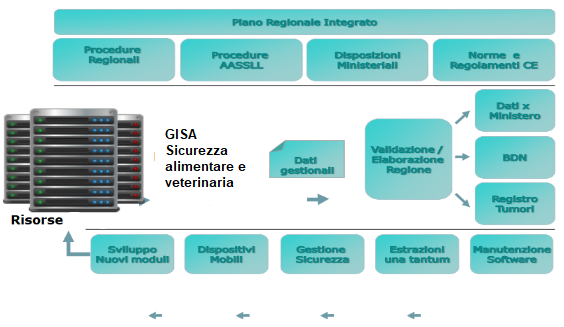

# GISA Sicurezza alimentare e veterinaria
- [1. Descrizione e finalità del software](#1-descrizione-e-finalità-del-software)
	- [1.1 Descrizione della struttura repository](#11-descrizione-della-struttura-repository)
- [2. Licenza](#2-licenza)
	- [2.1 Indirizzo e-mail segnalazioni di sicurezza](#21-indirizzo-e-mail-segnalazioni-di-sicurezza)
	- [2.2 Titolarità: Regione Campania](#22-titolarità-regione-campania)

# **1. Descrizione e finalità del software**

***GISA Sicurezza alimentare e veterinaria*** è composto da diversi componenti tra cui:

- Autenticazione tramite ***SPID/CIE*** 
- ***Gestione Integrata Notifiche Sanitarie***: modulo di gestione delle pratiche di registrazione/riconoscimento degli OSA (Operatore del Settore Alimentare) provenienti dai SUAP con possibilità di alimentazione tramite cooperazione applicativa.
- ***MATRIX***: modulo di gestione della programmazione a livello regionale, con il *Documento di programmazione Annuale Regionale (DPAR)*, e a livello territoriale, con il *Documento di programmazione Annuale Territoriale (DPAT)*. Esso consente di stimare il fabbisogno delle risorse umane necessarie a compiere le attività programmate.
- ***Gestione Controlli Ufficiali***: registrazione di tutti i dati relativi ai controlli ufficiali (tipo AUDIT, Ispezioni Semplici, Ispezioni in Sorveglianza), comprese le non conformità riscontrate, sanzioni amministrative applicate con generazione Avvisi di Pagamento PagoPA, sequestri, notizie di reato, follow up, ecc… con stampa della documentazione ufficiale precompilata (verbale ispezione, verbali di campionamenti, ecc…).
- ***Gestione Allerte Alimentari***: Registrazione di tutti i dati relativi ai controlli ufficiali effettuati per il sistema europeo RASFF (Rapid Alert System Food and Feed).
- ***Registro Trasgressori*** e ***Gestione degli illeciti amministrativi*** e delle ***Ordinanze regionali*** in cooperazione applicativa con PagoPA.
- ***Reportistica Avanzata***: cruscotto per la rendicontazione delle attività programmate con possibilità di verificare il lavoro svolto dalle singole strutture territoriali afferenti ai Dipartimenti di Prevenzione delle AA.SS.LL.
- ***Macellazioni***: modulo di gestione dei dati relativi alle singole sedute di macellazione (controllo documentale, visita *Ante Mortem*, visita *Post Mortem*, libero consumo, ecc…) con possibilità di stampa di documentazione ufficiale (Registro macellazione, articolo 17, modello 10, ecc…).
- Cooperazione Applicativa tra ecosistema ***GISA controlli ufficiali*** e ***Sistemi Nazionali*** per scambio dati su:
  - dati OSM 
  - dati checklist BA
  - dati scorta farmaci
  - dati anagrafe animali da compagnia 
  - dati checklist biosicurezza
  - dati checklist farmaco-sorveglianza
  - anagrafiche SINTESIS
  - anagrafiche Allevamenti
- ***Sistema di Autovalutazione** **del** **rischio***: modulo software che consente a imprese e operatori del settore alimentare e/o veterinari di migliorare la conduzione della propria attività, sia nelle modalità decisionali che gestionali, acquisendo consapevolezza dei punti di forza e di debolezza relativi alla/e propria/e attività. In particolare, consente di individuare e valutare il proprio livello di rischio rispondendo alle domande di una *check list* che fa parte del Sistema Ufficiale di Valutazione del Rischio delle imprese e che è utilizzata durante i controlli ufficiali delle AA.SS.LL. con riferimento alla propria linea di attività. L’accesso come ospite all’Autovalutazione può essere utile a coloro che hanno intenzione di avvicinarsi alle linee di attività del settore alimentare e/o veterinari e che desiderano conoscere le check list che verranno utilizzate dagli ispettori per i controlli.

Figura 3. Schema su Piano Regionale Integrato

L’intero ecosistema prevede diverse tipologie di utenti che possono essere schematizzati nelle seguenti macrocategorie:

- Utenti istituzionali Regionali
- Utenti istituzionali afferenti ai Dipartimenti di Prevenzione delle AA.SS.LL.
- Utenti istituzionali non appartenenti alle AA.SS.LL. : Forze dell’ordine, Esercito, Università, CRIUV, ecc…
- Utenti liberi professionisti: Veterinari Liberi Professionisti o delegati apicoltori, ecc…
- Utenti imprenditori: apicoltori, trasportatori, ecc...
- Privati cittadini: utenti che accedono alla componente di *Autovalutazione*.

Più precisamente le tipologie di utenti che possono registrarsi in GISA sono le seguenti:

- **ASL**
- **Regione**
- **Centri Riferimento Regionali**
- **IZSM**
- **Osservatori Regionali**
- **Forze dell'Ordine (Polizia stradale, Polizia municipale, Carabinieri, NAS, NAC, ICQ, Guardia forestale)**
- **Esercito**
- **Gestori Acque di rete**
- **Apicoltore Autoconsumo**
- **Apicoltore Commerciale**
- **Delegato Apicoltore / Associazione**
- **Gestore Trasporti**
- **Gestore Distributori (erogatori cibi e bevande)**
- **Operatore Settore Alimentare per autovalutazione**

Il totale stimato degli attuali utilizzatori è di circa **11.000** utenti (peraltro in continua crescita) distribuiti variamente sui sottosistemi.

Figura 4. Schematizzazione dei moduli di GISA Sicurezza alimentare e veterinaria

## **1.1 Descrizione della struttura repository**

Per ogni applicativo facente parte di GISA Sicurezza alimentare e veterinaria è presente il Repository dedicato:

  - _./gisa_controlli_ufficiali_  
  

  - -_./autovalutazione_
  

  - _./guc_      
  

  - _./sca_      
  

  - _./modulo_spid_cie_ 
  
  
  - _./matrix_reportisitica_avanzata_
  
  
  
  

 

# **2. Licenza**

**Soggetti incaricati del mantenimento del progetto open source**

U.S. s.r.l. 

## **2.1 Indirizzo e-mail segnalazioni di sicurezza**
Ogni segnalazione di eventuali problemi di sicurezza o bug relativo al software presente in questo repository, va segnalato unicamente tramite e-mail agli indirizzi presente nel file security.txt disponibile a questo [link](http://gisa.regione.campania.it/.well-known/security.txt)

NOTA: Le segnalazioni non vanno inviate attraverso l’issue tracker pubblico ma devono essere inviate confidenzialmente agli indirizzi e-mail presenti nel security.txt.

Lo strumento issue tracker può essere utilizzato per le richieste di modifiche necessarie per implementare nuove funzionalità.

## **2.2 Titolarità: [Regione Campania](http://www.regione.campania.it/)**
Concesso in licenza a norma di: **AGPL versione 3**;

E' possibile utilizzare l'opera unicamente nel rispetto della Licenza.

Una copia della Licenza è disponibile al seguente indirizzo: <https://www.gnu.org/licenses/agpl-3.0.txt>

**NOTE:**

In caso di riuso in toto o in parte di GISA Sicurezza alimentare e veterinaria, è necessario notificare l’adozione in riuso tramite l’apertura di un ticket (o analogo meccanismo quale una pull request) in questo repository. Inoltre, al contempo per gli aspetti organizzativi utili a potenziare i benefici derivanti dalla pratica del riuso tra PP.AA., come la partecipazione alla **Cabina di regia** per la condivisione di eventuali modifiche/integrazioni o innovazioni, è necessario darne tempestiva comunicazione alle seguenti e-mail:

[paolo.sarnelli@regione.campania.it]() 

[cinzia.matonti@regione.campania.it]()	

Gli enti che aderiscono al riuso di GISA entreranno a far parte della Cabina di Regia per condividere e partecipare all’evoluzione di GISA insieme alle altre PP.AA.