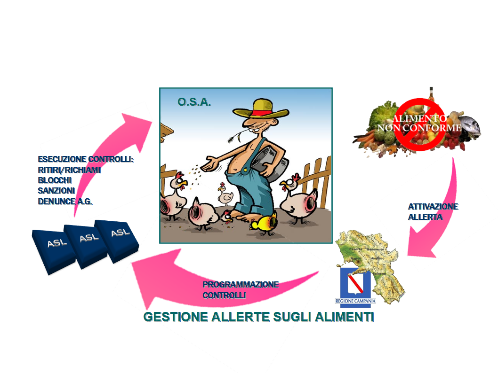
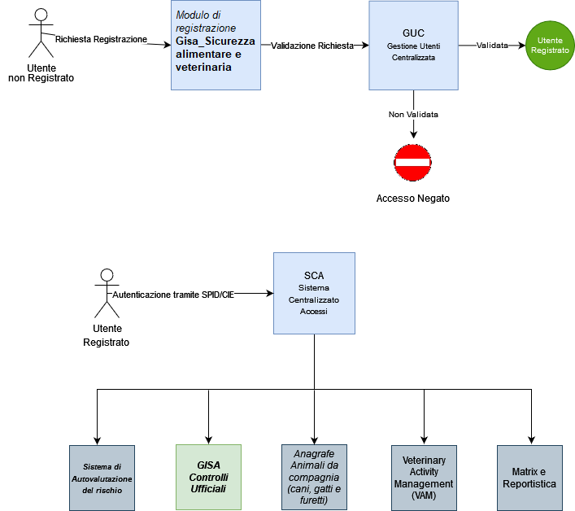

<p align="center">

</p>


# **G I S A - Gestione Informatizzata Servizi e Attività**
- [1. Descrizione e finalità del software](#1-descrizione-e-finalità-del-software)
  - [1.1 Descrizione della struttura repository](#11-descrizione-della-struttura-repository)
  - [1.2 Contesto di utilizzo e casi d’uso](#12-contesto-di-utilizzo-e-casi-duso)
  - [1.3 Riferimenti normativi](#13-riferimenti-normativi)
  - [1.4 Piattaforme abilitanti](#14-piattaforme-abilitanti)
  - [1.5 Interoperabilità con i sistemi esterni](#15-interoperabilità-con-i-sistemi-esterni)
  - [1.6 Link a pagine istituzionali relative al progetto](#16-link-a-pagine-istituzionali-relative-al-progetto)
  - [1.7 Interfaccia web](#17-interfaccia-web)
- [2. Architettura del software](#2-architettura-del-software)
  - [2.1 Descrizione delle directory](#21-descrizione-delle-directory)
- [3. Requisiti](#3-requisiti)
  - [3.1 Tecnologie utilizzate lato server](#31-tecnologie-utilizzate-lato-server)
  - [3.2 Tecnologie utilizzate lato client](#32-tecnologie-utilizzate-lato-client)
- [4. Riuso ed installazione](#4-riuso-ed-installazione)
  - [4.1 Build dai sorgenti](#41-build-dai-sorgenti)
  - [4.2 Riuso nell’ambito della stessa regione](#42-riuso-nellambito-della-stessa-regione)
  - [4.3 Riuso per enti di altre regioni](#43-riuso-per-enti-di-altre-regioni)
  - [4.4 Librerie esterne](#44-librerie-esterne)
  - [4.5 Creazione e import database](#45-creazione-e-import-database)
  - [4.6 Templates configurazione](#46-templates-configurazione)
  - [4.7 Installazione in un ambiente di sviluppo](#47-Installazione-in-un-ambiente-di-sviluppo)
  - [4.8 Installazione in un ambiente di produzione](#48-Installazione-in-un-ambiente-di-produzione)
- [5. Configurazione](#5-configurazione)
  - [5.1 Configurazione web.xml](#51-configurazione-webxml)
  - [5.2 Configurazione datasource.xml](#52-configurazione-datasourcexml)
  - [5.3 Configurazione context.xml](#53-configurazione-contextxml)
  - [5.4 Configurazione server.xml](#54-configurazione-serverxml)
  - [5.5 Prima dell'avvio applicativo](#55-prima-dellavvio-applicativo)
- [6. Licenza](#6-licenza)
  - [6.1 Gestione Informatizzata Servizi e Attività](#61-gisa---gestione-informatizzata-servizi-e-attività---controlli-ufficiali)
  - [6.2 Indirizzo e-mail segnalazioni di sicurezza](#62-indirizzo-e-mail-segnalazioni-di-sicurezza)
  - [6.3 Titolarità: Regione Campania](#63-titolarità-regione-campania)


# **1. Descrizione e finalità del software** 

***GISA Controlli Ufficiali*** è un framework applicativo basato su componenti ***open source best of breed*** che opportunamente personalizzato consente l'informatizzazione di servizi e attività in diversi ambiti tra cui: prevenzione e sanità pubblica veterinaria, sicurezza alimentare, sicurezza sui luoghi di lavoro.

Il modello tecnologico di riferimento è **Java EE (Java Enterprise Edition)** per componenti applicative distribuite sui tre livelli del pattern *Model View Control*. Il livello di front-end, la “*presentation logic*”, è implementata lato client ed è basata sugli strumenti offerti dal web-browser (XHTML, javascript, css) per la gestione dei controlli formali. Il livello intermedio, la “*application logic*”, è realizzato tramite i moduli (*servlet*) in esecuzione sull'*application server*. Il livello di back-end è costituito dal ***DBMS (Data Base Management System)***. Nel corso degli anni (a partire dal 2007), su mandato e indicazioni della Regione Campania, lo sviluppo del framework si è evoluto allo scopo di supportare l'attuale ***Ecosistema GISA***.

L'attuale personalizzazione del sistema GISA Controlli Ufficiali consente di gestire pienamente le attività relative al **PCRP** (*Piano dei Controlli Regionale Pluriennale*) della Regione Campania e la verifica dei **LEA** (Livelli Essenziali di Assistenza – DPCM 12 gennaio 2017). Inoltre, la reportistica GISA è utile ai fini della valutazione di alcuni degli indicatori del **NSG** (Nuovo Sistema di Garanzia - DM 12 marzo 2019) relativi all’area della *Prevenzione Collettiva e Sanità Pubblica*.

Il sistema fornisce gli strumenti gestionali e il supporto informatico per la programmazione, la gestione, la rendicontazione e l’inoltro puntuale ai competenti uffici del Ministero della Salute dei flussi informativi in materia di sicurezza alimentare e sanità pubblica veterinaria.

Il sistema è stato riconosciuto come **best-practice** dall'**OCSE - Organizzazione per la cooperazione e lo sviluppo economico** [(OECD Report)](https://gisa.regione.campania.it/moduloSpid/OECD_report.pdf).


In ***GISA Controlli Ufficiali*** è implementato l’intero processo di attivazione, gestione e rendicontazione delle ***Allerte Alimentari*** (Figura 1).





Figura 1. Processo di **Gestione Allerte** sugli alimenti in **GISA** – **Allerte alimentari**


In ***GISA Controlli Ufficiali*** è anche disponibile il processo di **Gestione Preaccettazione** campioni per laboratori ARPAC e SIGLA.
La **Preaccettazione** è il meccanismo di interoperabilità che consente il passaggio automatico di tutte le informazioni relative al campionamento
fra *GISA Controlli Ufficiali* e i sistemi informativi dei **LIMS** (sistema di accettazione campioni per laboratori ARPAC) e **SIGLA** (sistema di accettazione campioni per laboratori IZSM).
Questo passaggio comporta i seguenti aspetti positivi importanti:
1. il perfetto allineamento delle anagrafiche degli operatori, delle matrici e dei quesiti diagnostici
2. il risparmio in termini di tempo dell’operazione di accettazione dei campioni
3. la riduzione degli errori umani in fase di accettazione
Con la *Preaccettazione* al campione viene associato un codice univoco che in fase di accettazione del campione presso il laboratorio consentirà
il passaggio dei dati da *GISA controlli ufficiali* verso *LIMS/SIGLA*.
Da ultimo, l’alto livello di integrazione tra i due sistemi consentirà il passaggio inverso di
informazione da *GISA Controlli Ufficiali* a *SIGLA/LIMS*: il contenuto dei Rapporti di prova finale emesso dall’IZSM sarà
trasferito da *LIMS/SIGLA* e *GISA Controlli Ufficiali*.

<p align="center">

</p>


Figura 2. Processo di **Gestione Preaccettazione** campioni per laboratori ARPAC e SIGLA.


Nel sistema vengono gestiti i controlli ufficiali (***AUDIT, Ispezioni Semplici e Ispezioni con la Tecnica della Sorveglianza***) effettuati dal personale *delle* **A*utorità Competenti e di tutte le altre Autorità che effettuano controlli*** in materia di sicurezza alimentare e sanità pubblica veterinaria

Tra le tipologie di operatori/entità soggetti a controllo ufficiale anagrafati in ***GISA Controlli Ufficiali*** abbiamo:

- AZIENDE ZOOTECNICHE (recuperate direttamente dalla BDN mediante cooperazione applicativa)
- STABILIMENTI REGISTRATI ***Reg. CE 852/04***
- STABILIMENTI RICONOSCIUTI ***Reg. CE 853/04*** (recuperati direttamente dal SINTESIS mediante cooperazione applicativa)
- STABILIMENTI RICONOSCIUTI SOA ***Reg. CE 1069/09*** (recuperati direttamente dal SINTESIS mediante cooperazione applicativa)
- OSM (Operatori del Settore Mangimistico) REGISTRATI E RICONOSCIUTI (inviati al ***SINVSA*** in cooperazione applicativa)
- IMPIANTI DI MOLLUSCHICOLTURA
- MERCATI ALL'INGROSSO
- PUNTI DI SBARCO
- OPERATORI DEL FARMACO (GROSSISTI, FARMACIE E PARAFARMACIE)
- OPERATORI COMMERCIALI DI ANIMALI DA COMPAGNIA
- CANI PADRONALI
- COLONIE FELINE


Il sistema **GISA Controlli Ufficiali** fa parte dell'Ecosistema GISA.


L’***Ecosistema*** ***GISA*** è composto da diversi componenti tra cui:

- Autenticazione tramite ***SPID/CIE*** 
- ***Gestione Integrata Notifiche Sanitarie***: modulo di gestione delle pratiche di registrazione/riconoscimento degli OSA (Operatore del Settore Alimentare) provenienti dai SUAP con possibilità di alimentazione tramite cooperazione applicativa.
- ***MATRIX***: modulo di gestione della programmazione a livello regionale, con il *Documento di programmazione Annuale Regionale (DPAR)*, e a livello territoriale, con il *Documento di programmazione Annuale Territoriale (DPAT)*. Esso consente di stimare il fabbisogno delle risorse umane necessarie a compiere le attività programmate.
- ***Gestione Controlli Ufficiali***: registrazione di tutti i dati relativi ai controlli ufficiali (tipo AUDIT, Ispezioni Semplici, Ispezioni in Sorveglianza), comprese le non conformità riscontrate, sanzioni amministrative applicate con generazione Avvisi di Pagamento PagoPA, sequestri, notizie di reato, follow up, ecc… con stampa della documentazione ufficiale precompilata (verbale ispezione, verbali di campionamenti, ecc…).
- ***Gestione Allerte Alimentari***: Registrazione di tutti i dati relativi ai controlli ufficiali effettuati per il sistema europeo RASFF (Rapid Alert System Food and Feed).
- ***Registro Trasgressori*** e ***Gestione degli illeciti amministrativi*** e delle ***Ordinanze regionali*** in cooperazione applicativa con PagoPA.
- ***Reportistica Avanzata***: cruscotto per la rendicontazione delle attività programmate con possibilità di verificare il lavoro svolto dalle singole strutture territoriali afferenti ai Dipartimenti di Prevenzione delle AA.SS.LL.
- ***Macellazioni***: modulo di gestione dei dati relativi alle singole sedute di macellazione (controllo documentale, visita *Ante Mortem*, visita *Post Mortem*, libero consumo, ecc…) con possibilità di stampa di documentazione ufficiale (Registro macellazione, articolo 17, modello 10, ecc…).
- Cooperazione Applicativa tra ecosistema ***GISA*** e ***Sistemi Nazionali*** per scambio dati su:
  - dati OSM 
  - dati checklist BA
  - dati scorta farmaci
  - dati anagrafe animali da compagnia 
  - dati checklist biosicurezza
  - dati checklist farmaco-sorveglianza
  - anagrafiche SINTESIS
  - anagrafiche Allevamenti


Figura 3. Schema su Piano Regionale Integrato


L’intero ecosistema prevede diverse tipologie di utenti che possono essere schematizzati nelle seguenti macrocategorie:

- Utenti istituzionali Regionali
- Utenti istituzionali afferenti ai Dipartimenti di Prevenzione delle AA.SS.LL.
- Utenti istituzionali non appartenenti alle AA.SS.LL. : Forze dell’ordine, Esercito, Università, CRIUV, ecc…
- Utenti liberi professionisti: Veterinari Liberi Professionisti o delegati apicoltori, ecc…
- Utenti imprenditori: apicoltori, trasportatori, ecc...
- Privati cittadini: utenti che accedono alla componente di *Autovalutazione*.

Più precisamente le tipologie di utenti che possono registrarsi in GISA sono le seguenti:

- **ASL**
- **Regione**
- **Centri Riferimento Regionali**
- **IZSM**
- **ARPAC**
- **Osservatori Regionali**
- **Forze dell'Ordine (Polizia stradale, Polizia municipale, Carabinieri, NAS, NAC, ICQ, Guardia forestale)**
- **Esercito**
- **Gestori Acque di rete**
- **Apicoltore Autoconsumo**
- **Apicoltore Commerciale**
- **Delegato Apicoltore / Associazione**
- **Gestore Trasporti**
- **Gestore Distributori (erogatori cibi e bevande)**
- **Operatore Settore Alimentare per autovalutazione**


Il totale stimato è di circa **11.000** utenti (peraltro in continua crescita) distribuiti variamente sui sottosistemi.


Figura 4. Schematizzazione dei moduli dell’Ecosistema GISA


## **1.1 Descrizione della struttura repository**

-  _./database_ script sql per la creazione della struttura del DB

-  _./docs_ documentazione varia (cartella contenente file integrati nel readme: immagini, diagrammi, ecc.) 

-  _./lib_ librerie esterne (nel caso di librerie di terze parti conformi alla licenza AGPL 3)

-  _./templates_ file template per la configurazione del sistema

-  _./GISA\_nt_ sorgenti e struttura di cartelle della piattaforma
 
## **1.2 Contesto di utilizzo e casi d’uso**

Il contesto di utilizzo e casi d'uso del software sono descritti dettagliatamente nella [***Guida Utente***](https://gisaveterinaria.regione.campania.it/gisa_nt/man/).

Il sistema ***GISA Controlli Ufficiali*** integra la Gestione Avvisi di pagamento Sanzioni PagoPa/MyPay [***Guida PagoPa***](http://www.gisacampania.it/docs_ufficiali/GuidaPagoPa.pdf).


## **1.3 Riferimenti normativi**
L’attuale personalizzazione del sistema GISA Controlli Ufficiali gestisce le seguenti ***norme violabili*** da parte degli ***OSA***:

|**ACQUACOLTURA**|
| :- |
|D.L.vo 4/8/08 , n. 148|
|**ACQUE DESTINATE AL CONSUMO UMANO**|
|DECRETO LEGISLATIVO 15 febbraio 2016, n. 28  |
|D.L.vo 2/2/01, n. 31|
|D.P.R. 24/5/88, n. 236|
|**ACQUE MINERALI NATURALI**|
|LEGGE   REGIONALE   N.  8  DEL  29 LUGLIO 2008|
|D.L.vo 8/10/11 , n. 176|
|**ADDITIVI, ENZIMI, AROMI**|
|D.L.vo 25 gennaio 1992, n. 107|
|**ALCOLICI, VINI, ACETO**|
|L. 16/8/62, n. 1354|
|D.L. 30.10.52, n. 1322|
|R.D.L. 15/10/1925, n. 2033|
|LEGGE 12 dicembre 2016 , n. 238|
|**ALIMENTI BIOLOGICI**|
|LEGGE REGIONALE N. 24 DEL 12-08-1993|
|DECRETO LEGISLATIVO 23 febbraio 2018 , n. 20|
|**ALIMENTI DESTINATI AD UNA ALIMENTAZIONE PARTICOLARE ED INTEGRATORI ALIMENTARI**|
|D.M. 9/4/09, n. 82|
|DPR 7/4/1999, n. 128|
|D.L.vo 21/5/2004, n. 169|
|R.D. 27.7.34, n. 1265|
|D.L.vo 14/2/03, n. 31|
|D.M. 7/10/98, n. 519|
|D.M. 9/7/12|
|D.M. 16/1/02|
|D.M. 18/6/10|
|D.M. 23/2/06|
|DPR 19/1/98. n.  131|
|DPR 20/3/02, n. 57|
|REG. (UE) N. 609/2013|
|**ALIMENTI IGP, DOP, DOC**|
|Reg CE n. 2081/92|
|**APICOLTURA**|
|L.R. 29/3/06 N. 7|
|L. 28/7/16, n. 154|
|**ANAGRAFE ZOOTECNICA**|
|D.L.vo 16 febbraio 2011 , n. 29|
|REG (CE) N. 21/2004|
|REG (CE) N. 1760/2000|
|REG (CE) N. 1505/2006|
|D.P.R. 30/4/96, n. 317|
|D.L.vo 26/10/10, n. 200|
|D.L.vo 30 dicembre 1992, n. 529|
|D.M. 2 marzo 2018|
|**BENESSERE DEGLI ANIMALI DURANTE LA MACELLAZIONE O L'ABBATTIMENTO**|
|REG.  (CE) N. 1099/2009|
|**BENESSERE DEGLI ANIMALI DURANTE IL TRASPORTO**|
|Reg UE 30.1.20, n. 691|
|Reg UE 28.4.20, n. 990|
|Reg UE 1.12.19, n. 688|
|Reg. (CE) n. 1/2005|
|**BENESSERE DEGLI ANIMALI NEGLI ALLEVAMENTI**|
|DECRETO LEGISLATIVO 21 marzo 2005, n. 73 |
|D.L.vo 26/3/2001, n. 146|
|D.L.vo 29/7/03, n. 267|
|D.L.vo 27/9/10 , n. 181|
|D.L.vo 7/7/11 , n. 122|
|D.L.vo 7/7/11 , n. 126|
|**BEVANDE ANALCOLICHE**|
|D.L. 13.9.12, n. 158|
|LEGGE 30 ottobre 2014, n. 161  |
|DECRETO LEGISLATIVO 21 maggio 2004, n. 151 |
|L. 3/4/61, n. 286|
|DECRETO DEL PRESIDENTE DELLA REPUBBLICA 19 maggio 1958, n. 719 |
|**BURRO**|
|L. 23/12/56, n. 1526|
|**CARNI (NORME COMUNI)**|
|LEGGE 4 aprile 1964 , n. 171|
|**CARNI DI POLLAME**|
|Reg 543/2008|
|**CARNI DI BOVINO**|
|DECRETO MINISTERIALE 16 gennaio 2015  |
|REG (CE) N. 1760/2000|
|Reg. (CE) n. 1825/00|
|D.L.vo 22/5/99, n. 196|
|**CARNI DI SUINO**|
|D.L.vo 22/5/99, n. 196|
|**CASEINE**|
|L. 20 novembre 2017, n. 167|
|**CIOCCOLATO E CACAO**|
|D.L.vo 12 giugno 2003, n. 178|
|**COMMERCIO**|
|L.R. 21.4.2020, n. 7|
|D.L.vo 31/03/1998, N. 114|
|**DETERGENTI**|
|Reg.  (CE)  n.  648/2004|
|**ETICHETTATURA**|
|LEGGE 1 aprile 2022, n. 30|
|Reg CE n. 1924/2006|
|D.M. 27 marzo 2002|
|D.M. 26 luglio 2017  |
|D.M. 17 luglio 2013  |
|D.M. 16 novembre 2017  |
|D.M. 9 dicembre 2016  |
|D.Lgs. 16/02/1993 n° 77  |
|L. 3.8.04, n. 204 |
|L. 3/2/11 , n. 4|
|Reg UE 1169/2011|
|D.Lvo 15/9/2017 n. 145|
|**FARMACI VETERINARI**|
|D.L.vo 16/3/2006, n. 158|
|D.L.vo 6/4/2006, n. 193|
|D.L.vo 17.3.95, n. 110|
|FAUNA SELVATICA|
|L.R. 9/8/2012, n. 26|
|L. 11.2.92, n. 157|
|D.M. 24.12.12|
|Reg CE 9.12.96, n. 338|
|**FITOSANITARI**|
|R.D.L. 15 ottobre 1925, n. 2033|
|D.L.vo 14/8/12, n. 150|
|Reg. (CE) n. 1107/2009|
|Reg. (CE) n. 547/2011|
|DPR 23.4.01, n. 290|
|D.L.vo 17.3.95, n. 194|
|**FORMAGGI**|
|R.D.L. 15/10/1925, n. 2033|
|FUNGHI|
|L. 23/8/93, n. 352|
|DPR 14/7/95, n. 376|
|L.R. 24/7/07 N. 8 |
|**GELATI**|
|D.L. 13/9/2012, n. 158|
|**IGIENE URBANA VETERINARIA**|
|L.R. 24/11/01, n. 16|
|art. 672 Codice Penale|
|L. 14.8.91, n. 281|
|L.R. 11/04/19, n. 3|
|L. 4/11/10, n. 201|
|**IMPORTAZIONI E SCAMBI**|
|D.L.VO 22 maggio 1999, n. 196|
|D.L.vo 12.11.96, n. 633|
|D.L.vo 3.12.14, n. 199|
|D.L.vo 2.2.21, n. 23|
|D.L.vo 24/21|
|**IMPORTAZIONE**|
|**LATTE**|
|L. 03/5/1989, n. 169|
|D.L.vo 8/10/11 , n. 175|
|L. 11/4/74, n. 138|
|D.L. 13/9/2012, n. 158|
|L. 21/5/2019,  n.  44|
|**MACELLAZIONE**|
|Reg CE n. 1099/2009|
|**MALATTIE INFETTIVE DEGLI ANIMALI**|
|L. 4.6.10, n. 96|
|D.L.vo 3.12.14, n. 199|
|D.L.vo 20.2.04 n. 54|
|D.P.R. 8.2.54, n. 320|
|D.L.vo 22/5/99, n. 196|
|D.L.vo 25.1.10, n. 9|
|D.L.vo 19.8.05, n. 193|
|L. 2.6.88, n. 218|
|Art. 264 R.D. 27/7/34, n. 1265|
|legge 9/06/1964 n° 615|
|**MANGIMI**|
|Reg. CE 13.7.09, n. 767|
|D.L.vo 3.3.93, n. 90|
|L. 15.2.63, n. 281|
|D.L.vo 24/2/97, n. 45|
|D.L.vo 13/4/99, n. 123|
|REG. CE n. 183/2005|
|**MARGARINA**|
|L. 4/11/51, n. 1316|
|**MATERIALI A CONTATTO CON GLI ALIMENTI**|
|Reg.  (CE)  n. 10/2011|
|Reg.  (CE)  n. 50/2009|
|Reg.  (CE)  n. 282/2008|
|Reg.  (CE)  n. 2023/2006|
|Reg.  (CE)  n. 1895/2005|
|Reg.  (CE)  n.  1935/2004|
|DPR 23/8/82, n. 777|
|D.L.vo 10/2/2017, n. 29|
|**MIELE**|
|L. 28.7.16, n. 154|
|L.R. 29.3.06, n. 7|
|L. 24.12.04 n. 313|
|D.L.vo 21/5/04, n.179|
|**OGM**|
|D.L.vo 8.7.03 , n. 224|
|D.L.vo 14.11.16, n. 227|
|Reg. (CE) n. 1829/03|
|Reg CE n. 1830/03|
|**OLIO**|
|R.D.L. 15/10/1925, n. 2033|
|Reg CE 2568/91|
|Reg CE 29/12|
|L. 3/8/98, n. 313|
|LEGGE 14 gennaio 2013, n. 9|
|**PANE, PASTE ALIMENTARI, SFARINATI**|
|L. 04/07/1967, n° 580|
|DPR 9/2/01, n.187|
|D.P.R. 30/11/98, n. 502|
|L.R. 1/2/05, n. 2|
|**PRODOTTI DELLA PESCA**|
|D.L.vo 9.1.12, n. 4|
|D.L. 13/9/2012, n. 158|
|**PRODOTTI ORTOFRUTTICOLI FRESCHI E CONSERVATI**|
|Reg CE n. 1580/2007|
|R.D.L. 15/10/1925, n. 2033|
|L. 28/7/2016, n. 154  |
|L. 3/8/2004, n. 204|
|D.L.vo 20/2/04, n.50|
|**RIPRODUZIONE ANIMALE**|
|D.L.vo 30.12.92, n. 529|
|D.l.vo 11/5/2018, n. 52|
|**RISO**|
|L. 18/3/58, n. 325|
|SANIFICAZIONE|
|Reg CE  n.  648/2004|
|**SICUREZZA ALIMENTARE IN GENERE**|
|D. Lvo 2.2.2021, n. 27 e s.m.i.</p><p>D. L.vo 6.11.07, n. 193|
|DPR 327/80|
|Reg CE 178/02|
|Reg CE 852/04|
|Reg CE 853/04|
|Legge 116 del 11/08/14|
|**SOLVENTI**|
|D.L.vo 4.2.93, n. 64|
|**SOMMINISTRAZIONE**|
|L. 25/08/1991, N. 287|
|**SOTTOPRODOTTI DI ORIGINE ANIMALE**|
|Reg UE n. 142/2011|
|L.R. 22/11/2010, N. 14|
|Reg CE 1069/09|
|**SPERIMENTAZIONE ANIMALE**|
|D.Lvo 4.3.14, n. 26|
|**TRASPORTO ALIMENTI DEPERIBILI**|
|DPR 29.5.79, n. 404|
|L. 2.5.77, n. 264|
|**TRASPORTO ANIMALI**|
|Reg CE 1/2005 (per illeciti di competenza dell'UVAC)|
|Reg CE 1/2005 (per illeciti di competenza della UOD 01 Reg. Camp.)|
|**UOVA E PRODOTTI D'UOVO**|
|D.L.vo 4/2/93, n. 65|
|Reg. (CE) N. 589/08|
|**VARIE**|
|Reg. regionale 28 settembre 2017, n. 3|
|R.D. 27.7.34, n. 1265 T.U.LL.SS|
|**ZUCCHERO**|
|D.L.vo 20/2/04, n. 51|


## **1.4 Piattaforme abilitanti**
Le piattaforme abilitanti attualmente implementate in GISA Controlli Ufficiali sono:

- Autenticazione SPID/CIE
- PagoPA


## **1.5 Interoperabilità con i sistemi esterni**

1. SPID / CIE – Regione Campania
1. PagoPA – Regione Campania
1. Sigla IZSM 
1. LIMS ARPAC 
1. BDN Zootecnica
1. SINVSA
1. CLASSYFARM: autorizzazione detenzione scorta farmaci e invio checklist biosicurezza e farmacosorveglianza
1. SINAAF
1. BDA-N
1. ...

La cooperazione applicativa con i sistemi esterni avviene mediante web services di tipo ***SOAP*** e ***REST***.

La cooperazione applicativa interna all’ecosistema ***GISA*** avviene invece mediante ***microservices*** o ***DBI*** (***DataBase Interface***).

## **1.6 Link a pagine istituzionali relative al progetto**
- [gisasca.regione.campania.it](https://gisasca.regione.campania.it/)


## **1.7 Interfaccia web**
***GISA Controlli Ufficiali*** è dotato di un interfaccia web semplice ma molto dettagliata. È composto da molte categorie (chiamate anche cavalieri), ciascuna con i propri sotto menù. L'interfaccia si presenta nel modo seguente (nell’immagine sono visibili alcuni cavalieri abilitabili):


Figura 5. Rappresentazione della Home GISA Controlli Ufficiali personalizzabile secondo le esigenze


# **2. Architettura del software**
L'architettura software cioè l'organizzazione di base del sistema, espressa dalle sue componenti, dalle relazioni tra di loro e con l'ambiente, e i principi che ne guidano il progetto e l'evoluzione.





Figura 6. Organizzazione di base dell'Ecosistema GISA


Rappresentazione del flusso di fruizione: percorso di navigazione e relazioni tra contenuti


Figura 7. Flusso di fruizione


## **2.1 Descrizione delle directory**
La struttura sotto la cartella dei file sorgenti *./GISA\_nt* è una struttura tipica di un [app Tomcat](https://docs.oracle.com/cd/E19226-01/820-7627/bnadx/index.html)
# **3. Requisiti**
## **3.1 Tecnologie utilizzate lato server**
- [CentOS 7](https://www.centos.org/download/) 
- [Apache Tomcat 8.x](https://tomcat.apache.org/download-80.cgi) 
- [jdk 1.8.x](https://www.oracle.com/it/java/technologies/javase/javase8u211-later-archive-downloads.html)
- [Postgres 12.x ](https://computingforgeeks.com/how-to-install-postgresql-12-on-centos-7/)
- [git](https://git-scm.com/downloads) 
- [ant](https://ant.apache.org/bindownload.cgi) 
- Ambiente di sviluppo per compilazione di progetti Java EE (Java Enterprise Edition)
 
## **3.2 Tecnologie utilizzate lato client**
- [Windows](https://www.microsoft.com/it-it/software-download/) (dalla versione 10 in poi) 
- [Mozilla Firefox 99.0.1](https://www.mozilla.org/it/firefox/new/) (browser certificato) 

# **4. Riuso ed installazione**

## **4.1 Build dai sorgenti**
Tecnicamente ***GISA Controlli Ufficiali*** è un'applicazione in architettura web sviluppata con la tecnologia ***Java EE*** secondo il pattern ***MVC*** (M***odel View Controller***).

Come le applicazioni di questo genere ***GISA Controlli Ufficiali*** è quindi composta da un back-end in funzione di *Model* (in questo caso l'***RDBMS Postgresql***) una serie di risorse di front-end web (pagine ***HTML***, ***CSS***, immagini, ecc.) in funzione di *View* e infine, in funzione di *Controller*, le classi *java* componenti le *servlet* in esecuzione sul *servlet container* (in questo caso ***Tomcat***).

Come risultato del build, tutti i componenti (in formato compilato per le classi java, in formato nativo gli altri elementi) saranno inclusi in un unico archivio per il *deploy*.


## **4.2 Riuso nell’ambito della stessa regione**

Nell’ottica del risparmio e della razionalizzazione delle risorse è opportuno che gli enti che insistono sullo stesso territorio regionale utilizzino la modalità **Multi-Tenant** al fine di installare un unico sistema a livello regionale.


## **4.3 Riuso per enti di altre regioni**
Al fine di avvalersi dei benefici del riuso così come concepito dal **CAD** si chiede di notificarlo come indicato nel paragrafo 6.3 al fine di evitare sprechi e frammentazioni.

*Nota: Se lo scopo è avviare un processo di sviluppo per modificare la propria versione di **GISA Controlli Ufficiali**, potrebbe essere il caso di generare prima un proprio fork su GitHub e quindi clonarlo.*

Eseguire il seguente comando:

  ```
  git clone \
		  --depth 1  \
		  --filter=blob:none  \
		  --sparse \
		  https://github.com/regione-campania/GISA \
		;
		cd GISA
		git sparse-checkout set gisa_controlli_ufficiali
  ```

Sarà creata la directory GISA\_nt. Da qui in avanti si farà riferimento a questa directory chiamandola "directory base".

## **4.4 Librerie esterne**

Come tutte le applicazioni complesse, **GISA Controlli Ufficiali** utilizza un elevato numero di librerie in buona parte autocontenute a livello di repository, presenti nel file _build_lib.tar_ nella directory _./lib_.


La configurazione di partenza, modificabile agendo a livello del _build.xml_ sulla variabile _tom.dir_  è:

 _tom.dir=/usr/share/tomcat_
 
 Nel caso in cui si utilizzi come nodo di compilazione una macchina su cui è installato anche Tomcat, si consiglia di disaccoppiare espicitamente la directory delle librerie di compilazione (BuildLibDir)  da quella di tomcat (RuntimeLibDir) configurando nel build.xml - ad esempio - una delle seguenti:
 
      tom.dir=/usr/share/tomcat.build
 
 oppure
 
      tom.dir=/opt/tomcat.build

Nella nostra directory _tomcat.build_ deve essere importato il file tar _gisa_controlli_ufficiali/lib/build_lib.tar_ con il comando:

```
  mv <gisa_controlli_ufficiali/lib/build_lib.tar> <BuildLibDir>
```
```
  tar -xvf <BuildLibDir>/build_lib.tar
```
 
 Per aggiungere le librerie mancanti a tomcat, senza sovrascrivere eventuali jar con lo stesso nome già presenti in _tomcat/lib_, eseguire il comando:
 
```
  rsync -a --ignore-existing <BuildLibDir>/lib/* <RuntimeLibDir>/lib
```
## **4.5 Creazione e import database**


Assicurarsi che nel file di configurazione pg_hba.conf sia correttamente configurato l'accesso dell'IP del nodo Tomcat al database: 
```
 host         all         all       <ipapplicativo>       trust
```
```
systemctl reload postgresql-12.service
```

Creazione Database e import dello schema tramite i seguenti comandi, con _dbuser_ e _dbhost_ adeguatamente valorizzati :

```
psql -U <dbuser> -h <dbhost> -c "create database gisa"
```

Posizionarsi nella directory _gisa_controlli_ufficiali_ ed eseguire il comando: 

```
psql -U <dbuser> -h <dbhost> -d gisa < database/gisa_db_dev.sql
```

## **4.6 Templates configurazione**

Sotto la directory *./templates* sono presenti i file: 

*./templates/application.properties* 

*./templates/application.propertiesCOLLAUDO* 

da essere configurati ed inseriti sotto la directory 

*./GISA\_nt/src/org/aspcfs/modules/util/imports/.* 

Nel caso in cui la configurazione del templates viene fatta successivamente alla compilazione, il path corretto è:

*webapps/GISA\_nt/WEB-INF/classes/org/aspcfs/modules/util/imports/*

Sotto la stessa directory ./templates è presente anche il file 

./templates/conf\_PEC.xml

che va configurato ed inserito sotto la directory ./GISA\_nt/src/org/aspcfs/modules/allerte/base/.

## **4.7 Installazione in un ambiente di sviluppo**
- Eclipse Java EE IDE for Web Developers. Version: Mars.2 Release (4.5.2) Disponibile al seguente indirizzo: https://www.eclipse.org/downloads/packages/release/mars/2/eclipse-ide-java-ee-developers

- Spostare la directory _gisa_nt_ nel WorkSpace locale di Eclipse
- Nuovo progetto GISA con Import directory _gisa_nt_
- Import Existing project into Workspace
- Cliccare tasto destro sul progetto Gisa_nt e andare su properties
- Andare sul menù Build Path, selezionare add External Jars
- Unzippare il tar sotto la directory _./lib_ e importare le librerie nel progetto
- Andare sul menù Project Facets, spuntare le voci Dynamic Web Module e Java
- Fare export del progetto selezionado la voce Web (War file) e selezionare una destinazione per il file war
-  A compilazione avvenuta, sarà disponibile nella directory base il _war_ `gisa_nt.war` pronto per il deploy sotto Tomcat, 
secondo le abituali modalità previste per le _webapps_ da questo application server (copia del _war_ sotto _tomcatDir_/webapps) esecuzione comando

```
chown -R tomcat:tomcat /<tomcatDir> 
```

-  Successivamente continuare con i passi successivi della procedura di produzione.
 
## **4.8 Installazione in un ambiente di produzione**

Prerequisiti:

- Clonare il repository GISA Controlli Ufficiali (Vedi paragrafo: 4.3 Riuso per enti di altre regioni) :

git clone \
		  --depth 1  \
		  --filter=blob:none  \
		  --sparse \
		  https://github.com/regione-campania/GISA \
		;
		cd GISA
		git sparse-checkout set gisa_controlli_ufficiali
- Installare le librerie esterne (Vedi paragrafo: Librerie esterne)

- Creare ed importare database (Vedi paragrafo: Creazione e import database)

- Configurare i templates (Vedi paragrafo: Templates configurazione)

Compilazione:

-  All'interno della directory base, eseguire il comando di compilazione `ant build-war`.

-  A compilazione avvenuta, sarà disponibile nella directory scelta il _war_ `gisa_nt.war` pronto per il deploy sotto Tomcat, secondo le abituali modalità previste per le _webapps_ da questo application server (copia del _war_ sotto _tomcatDir_/webapps) esecuzione comando


```
chown -R tomcat:tomcat /<tomcatDir> . 
```


# **5. Configurazione**
 
# **5.1 Configurazione web.xml**

In *tomcat/conf/web.xml*

cercare la servlet:

\<servlet-class\>org.apache.jasper.servlet.JspServlet\</servlet-class\>

e aggiungere:

     <init-param><param-name>strictQuoteEscaping</param-name><param-value>false</param-value></init-param>


il risultato finale deve essere simile a questo:


    <servlet>
        <servlet-name>jsp</servlet-name>
        <servlet-class>org.apache.jasper.servlet.JspServlet</servlet-class>

       <init-param><param-name>strictQuoteEscaping</param-name><param-value>false</param-value></init-param>

        <init-param>
            <param-name>fork</param-name>
            <param-value>false</param-value>
        </init-param>
        <init-param>
            <param-name>xpoweredBy</param-name>
            <param-value>false</param-value>
        </init-param>
        <load-on-startup>3</load-on-startup>
    </servlet>
	
## **5.2 Configurazione datasource.xml**

Creare il file tomcat/conf/GISA-datasource.xml e copiare il contenuto sostituendo *dbhost* e *dbuser* con i rispettivi valori.

```
 <Resource
        type="javax.sql.DataSource"
        name="jdbc/gisaM"
        factory="org.apache.tomcat.jdbc.pool.DataSourceFactory"
        driverClassName="org.postgresql.Driver"
        url="jdbc:postgresql://<dbhost>:5432/gisa" 
        username="<dbuser>"
        maxWait="30000"
        maxActive="10"
        minIdle="2"
        maxIdle="3"
        timeBetweenEvictionRunsMillis="15000"
        removeAbandoned="true"
        removeAbandonedTimeout="55"
        logAbandoned="true"
        initialSize="3"
        testOnBorrow="true"
        testOnReturn="false"
        testWhileIdle="true"
        minEvictableIdleTimeMillis="30000"
        validationInterval="30000"
        validationQuery="SELECT 1"
 />
```

## **5.3 Configurazione context.xml**

 
 Nel file tomcat/conf/context.xml deve essere inserito nella sezione _Context_:

 ```
 <ResourceLink global="jdbc/gisaM" name="jdbc/gisaM" type="javax.sql.DataSource"/>
 ```
 
## **5.4 Configurazione server.xml**

Nel file tomcat/conf/server.xml dopo l'intestazione deve essere inserito:


     <!DOCTYPE server [
     <!ENTITY gisa-datasource SYSTEM "./gisa-datasource.xml">
     ]>

nella sezione _GlobalNamingResources_ aggiungere:


     &gisa-datasource;


nella sezione _Host_ aggiungere il context _gisa_nt_ come da esempio seguente:

\<Host name="localhost"  appBase="webapps"
  unpackWARs="true" autoDeploy="false"\>

 .....................
	
		
```    
        <Context docBase="gisa_nt" path="/gisa_nt" reloadable="false" source="org.eclipse.jst.jee.server:gisa_nt" swallowOutput="true">
          <Parameter name="context_starting" value="gisa_nt"/>
        </Context>
```
 
 \</Host\>
 
 
 
 
 
## **5.5 Prima dell'avvio applicativo**

Una volta completati tutti i passaggi, bisogna ravviare tomcat:
```
systemctl daemon-reload
systemctl restart tomcat

```

Infine aprire Mozilla Firefox, inserire nella barra di ricerca: 

```
<ipserver>:8080/gisa_nt
```

# **6. Licenza**

## **6.1 GISA - Gestione Informatizzata Servizi e Attività - Controlli Ufficiali**
Stato Software : Stabile

Browser certificato : Mozilla Firefox 99.0.1

**Soggetti incaricati del mantenimento del progetto open source**

U.S. s.r.l. 
## **6.2 Indirizzo e-mail segnalazioni di sicurezza**
Ogni segnalazione di eventuali problemi di sicurezza o bug relativo al software presente in questo repository, va segnalato unicamente tramite e-mail agli indirizzi presente nel file security.txt disponibile a questo [link](http://gisa.regione.campania.it/.well-known/security.txt)

NOTA: Le segnalazioni non vanno inviate attraverso l’issue tracker pubblico ma devono essere inviate confidenzialmente agli indirizzi e-mail presenti nel security.txt.

Lo strumento issue tracker può essere utilizzato per le richieste di modifiche necessarie per implementare nuove funzionalità.

## **6.3 Titolarità: [Regione Campania](http://www.regione.campania.it/)**
Concesso in licenza a norma di: **AGPL versione 3**;

E' possibile utilizzare l'opera unicamente nel rispetto della Licenza.

Una copia della Licenza è disponibile al seguente indirizzo: <https://www.gnu.org/licenses/agpl-3.0.txt>

**NOTE:**

In caso di riuso, in toto o in parte, dell’ecosistema software GISA, è necessario notificare l’adozione in riuso tramite l’apertura di un ticket (o analogo meccanismo quale una pull request) in questo repository. Inoltre, al contempo per gli aspetti organizzativi utili a potenziare i benefici derivanti dalla pratica del riuso tra PP.AA., come la partecipazione alla **Cabina di regia** per la condivisione di eventuali modifiche/integrazioni o innovazioni, è necessario darne tempestiva comunicazione alle seguenti e-mail:

[paolo.sarnelli@regione.campania.it]() 

[cinzia.matonti@regione.campania.it]()	

Gli enti che aderiscono al riuso di GISA entreranno a far parte della Cabina di Regia per condividere e partecipare all’evoluzione di GISA insieme alle altre PP.AA.