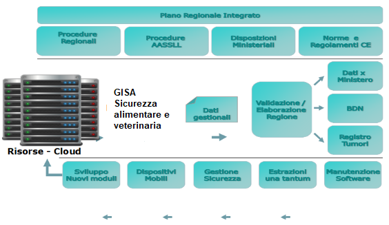
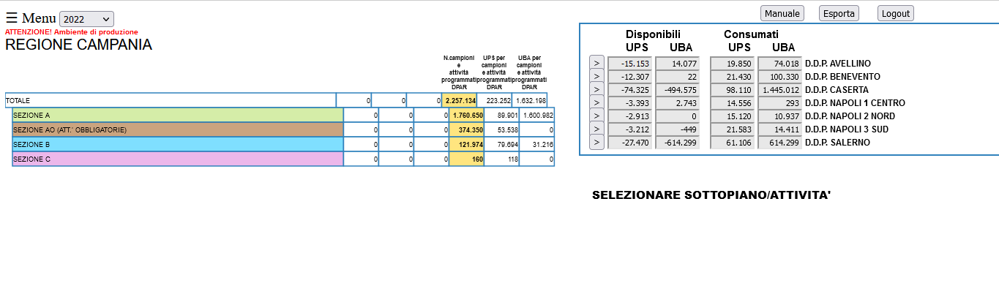
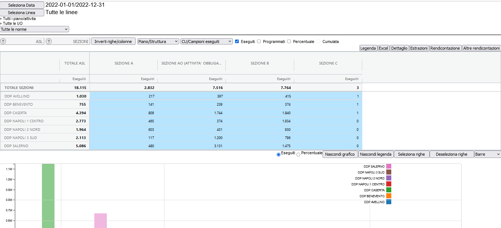
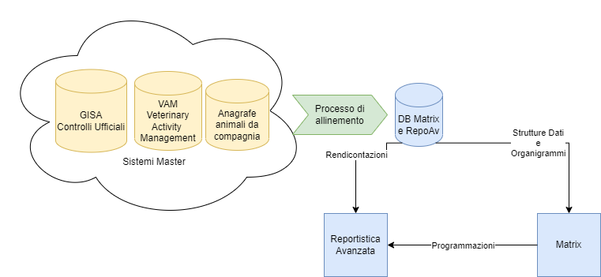

<p align="center">

</p>

# MATRIX & REPORTISTICA AVANZATA

- [1. Descrizione e finalità del software](#1-descrizione-e-finalità-del-software)
  - [1.1 Descrizione della struttura repository](#11-descrizione-della-struttura-repository)
  - [1.2 Contesto di utilizzo e casi d’uso](#12-contesto-di-utilizzo-e-casi-duso)
  - [1.3 Interoperabilità con i sistemi interni](#13-interoperabilità-con-i-sistemi-interni)
  - [1.4 Link a pagine istituzionali relative al progetto](#14-link-a-pagine-istituzionali-relative-al-progetto)
  - [1.5 Interfaccia web](#15-interfaccia-web)
- [2. Architettura del software](#2-architettura-del-software)
- [3. Requisiti](#3-requisiti)
  - [3.1 Tecnologie utilizzate lato server](#31-tecnologie-utilizzate-lato-server)
  - [3.2 Tecnologie utilizzate lato client](#32-tecnologie-utilizzate-lato-client)
- [4. Riuso ed installazione](#4-riuso-ed-installazione)
  - [4.1 Riuso nell’ambito della stessa regione](#41-riuso-nellambito-della-stessa-regione)
  - [4.2 Riuso per enti di altre regioni](#42-riuso-per-enti-di-altre-regioni)
  - [4.3 Librerie esterne](#43-librerie-esterne)
  - [4.4 Creazione e import database](#44-creazione-e-import-database)
  - [4.5 Templates configurazione](#45-templates-configurazione)
  - [4.6 Installazione in un ambiente di sviluppo](#46-Installazione-in-un-ambiente-di-sviluppo)
  - [4.7 Installazione in un ambiente di produzione](#47-installazione-ambiente-di-produzione)
- [5. Configurazione](#5-configurazione)
  - [5.1 Configurazione common/config.php](#51-configurazione-commonconfigphp)
  - [5.2 Test di installazione](#52-test-di-installazione)
- [6. Licenza](#6-licenza)
  - [6.1 Matrix - Reportistica Avanzata](#61-matrix---reportistica-avanzata)
  - [6.2 Indirizzo e-mail segnalazioni di sicurezza](#62-indirizzo-e-mail-segnalazioni-di-sicurezza)
  - [6.3 Titolarità: Regione Campania](#63-titolarità-regione-campania)

# **1. Descrizione e finalità del software**

**Matrix** è il sistema per la compilazione del documento di programmazione a livello regionale (DPAR) e a livello territoriale (DPAT). Dal cruscotto di **reportistica avanzata** sono consultabili il numero totale delle ispezioni semplici (sia aperte che chiuse) ed il numero totale dei campioni (con esito 'Nessun esito', 'Non Conforme', 'Conforme', 'Conforme con Riserva') a partire dall'anno 2019. I due sistemi compongono un framework applicativo da personalizzare (per utenti, ruoli, organigrammi, piani, anagrafiche, procedure di CU, verbali, moduli, report, ecc.) e non un sistema immediatamente usabile in produzione. 

Il sistema **Matrix** e **Reportistica avanzata** fanno parte dell'Ecosistema GISA.

L’***Ecosistema*** ***GISA*** è composto da diversi componenti tra cui:

- Autenticazione tramite ***SPID/CIE*** 
- ***MATRIX***: modulo di gestione della programmazione a livello regionale, con il *Documento di programmazione Annuale Regionale (DPAR)*, e a livello territoriale, con il *Documento di programmazione Annuale Territoriale (DPAT)*. Esso consente di stimare il fabbisogno delle risorse umane necessarie a compiere le attività programmate.





Figura 1. Schema su Piano Regionale Integrato


L’intero ecosistema prevede diverse tipologie di utenti che possono essere schematizzati nelle seguenti macrocategorie:

- Utenti istituzionali Regionali
- Utenti istituzionali afferenti ai Dipartimenti di Prevenzione delle AA.SS.LL.
- Utenti istituzionali non appartenenti alle AA.SS.LL. : Forze dell’ordine, Esercito, Università, CRIUV, ecc…
- Utenti liberi professionisti: Veterinari Liberi Professionisti o delegati apicoltori, ecc…
- Utenti imprenditori: apicoltori, trasportatori, ecc...
- Privati cittadini: utenti che accedono alla componente di *Autovalutazione*.

Più precisamente le tipologie di utenti che possono registrarsi in GISA sono le seguenti:

- **ASL**
- **Regione**
- **Centri Riferimento Regionali**
- **IZSM**
- **ARPAC**
- **Osservatori Regionali**
- **Forze dell'Ordine (Polizia stradale, Polizia municipale, Carabinieri, NAS, NAC, ICQ, Guardia forestale)**
- **Esercito**
- **Gestori Acque di rete**
- **Apicoltore Autoconsumo**
- **Apicoltore Commerciale**
- **Delegato Apicoltore / Associazione**
- **Gestore Trasporti**
- **Gestore Distributori (erogatori cibi e bevande)**
- **Operatore Settore Alimentare per autovalutazione**

Il totale stimato è di circa **11.000** utenti (peraltro in continua crescita) distribuiti variamente sui sottosistemi.


Figura 2. Schematizzazione dei moduli dell’Ecosistema G.I.S.A.


## **1.1 Descrizione della struttura repository**

  - _./database_   script sql per la creazione della struttura del DB 

  - _./docs_       documentazione varia (cartella contenente file integrati nel readme: immagini, diagrammi, ecc.) 

  - _./templates   file template per la configurazione del sistema

  - _./matrix_      sorgenti e struttura di cartelle dell'applicativo

  - _./repoav_      sorgenti e struttura di cartelle dell'applicativo


## **1.2 Contesto di utilizzo e casi d’uso**

 Il contesto di utilizzo e casi d'uso del software sono descritti dettagliatamente nella [guida utente MATRIX](https://gisamatrix.regione.campania.it/manuale.php) 
 

 
 


## **1.3 Interoperabilità con i sistemi interni**
 
-G.I.S.A

-VAM

-Anagrafe Animali da compagnia


La cooperazione applicativa interna all’ecosistema ***GISA*** avviene invece mediante ***microservices*** o ***DBI*** (***DataBase Interface***).

## **1.4 Link a pagine istituzionali relative al progetto**

- [gisasca.regione.campania.it](https://gisasca.regione.campania.it)

## **1.5 Interfaccia web**

MATRIX è dotato di un interfaccia web semplice ma molto dettagliata, che si presenta in questo modo: 





Figura 3. Home del Matrix


Questa invece la home di Reportistica Avanzata:




Figura 4. Home del cruscotto di  Reportistica avanzata


# **2. Architettura del software**

L'architettura software cioè l'organizzazione di base del sistema, espressa dalle sue componenti, dalle relazioni tra di loro e con l'ambiente, e i principi che ne guidano il progetto e l'evoluzione è descritto tramite le immagini seguenti:





Figura 5. Architettura di entrambi gli applicativi(il processo di allineamento di entrambi i sistemi avviene mediante dbi tramite dblink)


Figura 6. Organizzazione di base dell'Ecosistema GISA


# **3. Requisiti**


## **3.1 Tecnologie utilizzate lato server**

 - [CentOS 7](https://www.centos.org/download/)
 - [Apache HTTP Server 2.4.x](https://httpd.apache.org/) 
 - [Postgres  12.x ](https://computingforgeeks.com/how-to-install-postgresql-12-on-centos-7/)
 - [git](https://git-scm.com/downloads)
 - [PHP server 5.6.x](https://www.php.net/releases/5_6_0.php)
 
## **3.2 Tecnologie utilizzate lato client** 

- [Windows](https://www.microsoft.com/it-it/software-download/) (dalla versione 10 in poi)
- [Mozilla Firefox 99.0.1](https://www.mozilla.org/it/firefox/new/) (Browser Certificato)


 
# **4. Riuso ed installazione**

 

## **4.1 Riuso nell’ambito della stessa regione**

Nell’ottica del risparmio e della razionalizzazione delle risorse è opportuno che gli enti che insistono sullo stesso territorio regionale utilizzino la modalità **Multi-Tenant** al fine di installare un unico sistema a livello regionale.


## **4.2 Riuso per enti di altre regioni**

Al fine di avvalersi dei benefici del riuso così come concepito dal **CAD** si chiede di notificarlo come indicato nel paragrafo 6.3 al fine di evitare sprechi e frammentazioni.

*Nota: Se lo scopo è avviare un processo di sviluppo per modificare la propria versione di Matrix/Reportistica Avanzata, potrebbe essere il caso di generare prima un proprio fork su GitHub e quindi clonarlo.*

Eseguire il seguente comando:

        git clone \
		  --depth 1  \
		  --filter=blob:none  \
		  --sparse \
		  https://github.com/regione-campania/GISA \
		;
		cd GISA
		git sparse-checkout set matrix_reportistica_avanzata

Sarà creata la directory matrix_reportistica_avanzata. Da qui in avanti si farà riferimento a questa directory chiamandola "directory base".


## **4.3 Librerie esterne**

 MATRIX utilizza le seguenti librerie referenziate dal client al repository cloud del produttore:
  

- [d3.v4.min.js](https://d3js.org/d3.v4.min.js)
- [jquery-3.6.0.min.js](https://code.jquery.com/jquery-3.6.0.min.js)
- [jquery-ui.js](https://code.jquery.com/ui/1.13.0/jquery-ui.js)


Questi invece i moduli php necessari:

- php-mcrypt 
- php-cli 
- php-gd 
- php-curl  
- php-ldap 
- php-zip 
- php-fileinfo 
- php-mbstring 
- php-json 
- php-pgsql 
- php-xml


## **4.4 Creazione e import database**


Assicurarsi che nel file di configurazione pg_hba.conf sia correttamente configurato l'accesso dell'IP del nodo Tomcat al database: 
```
 host         all         all       <ipapplicativo>       trust
```
```
systemctl reload postgresql-12.service
```

Creazione database e import dello schema tramite i seguenti comandi, con _dbuser_ e _dbhost_ adeguatamente valorizzati :

```
psql -U <dbuser> -h <dbhost> -c "create database mdgm"
```

Posizionarsi nella directory _matrix_reportistica_avanzata_ ed eseguire il comando: 

```
psql -U <dbuser> -h <dbhost> -d mdgm < database/matrix_db.sql
```


## **4.5 Templates configurazione**

-	Sotto la directory _./templates_ è presente il file template _./templates/matrix/config.php_ , da configurare e inserire sotto le directory _./matrix/common_
	
-	Sotto la directory _./templates_ è presente il file template _./templates/repoav/config.php_ , da configurare e inserire sotto le directory _./repoav/common_ 


## **4.6 Installazione in un ambiente di sviluppo**

- Installare _Visual_ _Studio_ _Code_ Disponibile al seguente indirizzo: https://code.visualstudio.com/

oppure

- Installare _Notepad++_ Disponibile al seguente indirizzo: https://notepad-plus-plus.org/downloads/

- Le istruzioni per l'installazione di un ambiente di sviluppo sono le stesse della procedura di installazione ambiente di produzione.


## **4.7 Installazione ambiente di produzione**

Prerequisiti 

- Clonare il repository MATRIX – REPORTISTICA AVANZATA (Vedi paragrafo: 4.2 Riuso per enti di altre regioni):

	git clone \
		  --depth 1  \
		  --filter=blob:none  \
		  --sparse \
		  https://github.com/regione-campania/GISA \
		;
		cd GISA
		git sparse-checkout set matrix_reportistica_avanzata
		
- Installare le librerie esterne ed i moduli php necessari (Vedi paragrafo: Librerie esterne)

- Creare ed importare database (Vedi paragrafo: Creazione e import database )

- Configurare i templates (Vedi paragrafo: Templates configurazione)


Installazione:


- Per l'installazione di PHP 5.6 su CentOS è consigliabile seguire la guida presente in questo link:
	https://www.tecmint.com/install-php-5-6-on-centos-7/

- Installazione Moduli PHP necessari:

```
yum install php php-mcrypt php-cli php-gd php-curl  php-ldap php-zip php-fileinfo php-mbstring php-json php-pgsql php-xml

```
 
A partire dalla directory base spostare la cartella _matrix_  sotto la directory /var/www/html/ 

A partire dalla directory base spostare la cartella _repoav_ sotto la directory /var/www/html/

- Disabilitare SElinux con i seguenti passaggi: 

```
vi /etc/selinux/config
```

Settare SELINUX=disabled

```
SELINUX=disabled
```
Riavviare linux

```
reboot
```
Per controllare che SElinux si è disabilitato correttamente eseguire:
```
sestatus
```


 
# **5. Configurazione**


## **5.1 Configurazione common/config.php**

- Per entrambi i sistemi configurare il file common/config.php copiato dalla cartella template settando i parametri di connessione al database importato (vedi Creazione e import Database),esempio:
```
$_CONFIG['db_host'] = "";  //--INDIRIZZO IP DB HOST--
$_CONFIG['db_port'] = ""; //--PORTA DB--
$_CONFIG['db_user'] = ""; //--USER DB--
$_CONFIG['db_psw'] = ""; //--PASSWORD DB--
$_CONFIG['db_name'] = ""; //--NOME DB--
```


- In particolare per Matrix, configurare i parametri _mod4_year_ e _matrix_year_ in base all'anno di default da visualizzare rispettivamente nella sezione _Modello 4_ e della _Home_ dell'applicativo Matrix.
 
- In particolare per Reportistica Avanzata, configurare il parametro _ra_year_ in base all'anno di default da visualizzare nell'applicativo.

Dopo aver effettuato tutti i passaggi, restartare Apache con il comando:
```
systemctl restart httpd
```


# **5.2 Test di installazione**

Una volta avviato Apache HTTP Server provare ad accedere agli applicativi tramite browser Firefox attraverso i servizi wrapper per la login:

MATRIX
```

http://<miosito>:<porta>/matrix/loginWrapper.php?id_asl=-1&username=sysadm&password=sysadm
```

REPORTISTICA AVANZATA
```

http://<miosito>:<porta>/repoav/loginWrapper.php?id_asl=-1&username=sysadm&password=sysadm
```


# **6. Licenza**

## 6.1 **Matrix - Reportistica Avanzata**

Stato Software : Stabile

Browser certificato : Mozilla Firefox 99.0.1

**Soggetti incaricati del mantenimento del progetto open source**

U.S. s.r.l. 
## **6.2 Indirizzo e-mail segnalazioni di sicurezza**
Ogni segnalazione di eventuali problemi di sicurezza o bug relativo al software presente in questo repository, va segnalato unicamente tramite e-mail agli indirizzi presente nel file security.txt disponibile a questo [link](http://gisa.regione.campania.it/.well-known/security.txt)

NOTA: Le segnalazioni non vanno inviate attraverso l’issue tracker pubblico ma devono essere inviate confidenzialmente agli indirizzi e-mail presenti nel security.txt.

Lo strumento issue tracker può essere utilizzato per le richieste di modifiche necessarie per implementare nuove funzionalità.

## **6.3 Titolarità: [Regione Campania](http://www.regione.campania.it/)**
Concesso in licenza a norma di: **AGPL versione 3**;

E' possibile utilizzare l'opera unicamente nel rispetto della Licenza.

Una copia della Licenza è disponibile al seguente indirizzo: <https://www.gnu.org/licenses/agpl-3.0.txt>

**NOTE:**

In caso di riuso, in toto o in parte, dell’ecosistema software G.I.S.A., è necessario notificare l’adozione in riuso tramite l’apertura di un ticket (o analogo meccanismo quale una pull request) in questo repository. Inoltre, al contempo per gli aspetti organizzativi utili a potenziare i benefici derivanti dalla pratica del riuso tra PP.AA., come la partecipazione alla **Cabina di regia** per la condivisione di eventuali modifiche/integrazioni o innovazioni, è necessario darne tempestiva comunicazione alle seguenti e-mail:

[paolo.sarnelli@regione.campania.it]() 

[cinzia.matonti@regione.campania.it]()	

Gli enti che aderiscono al riuso di GISA entreranno a far parte della Cabina di Regia per condividere e partecipare all’evoluzione di GISA insieme alle altre PP.AA.